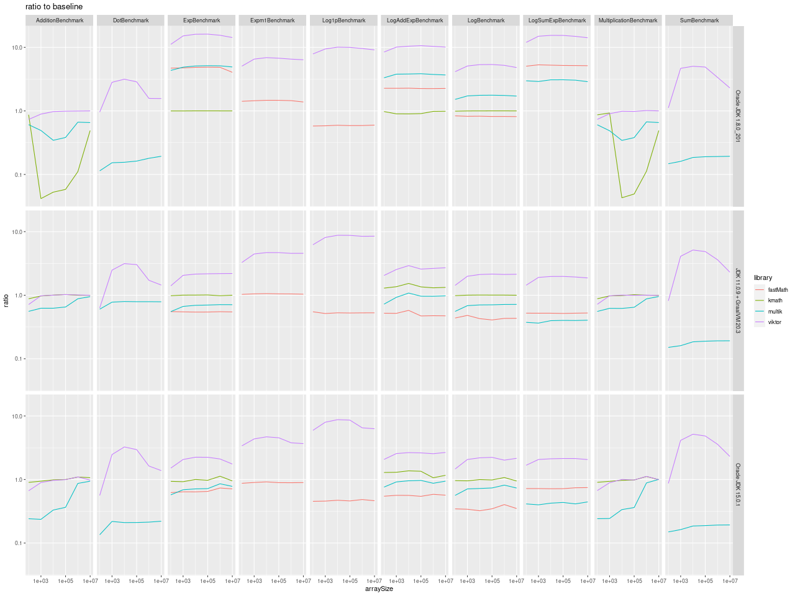

# Benchmarking Kotlin mathematical libraries

The goal of this project is to compare the performance of several mathematical libraries
for Kotlin.

## Libraries

[kmath](https://github.com/mipt-npm/kmath)

[multik](https://github.com/Kotlin/multik)

[viktor](https://github.com/JetBrains-Research/viktor)

## Benchmarks

We test the performance of the following operations:
* elementwise addition and multiplication of two double arrays, both with and without an offset
* dot product (aka scalar product) of two double arrays
* sum of all elements of a double array
* elementwise exponent, logarithm, `expm1` and `log1p` of a double array

We also test the performance of the "naive" Kotlin implementations of these operations.

## Running

This is a JMH project. Its intended execution mode is
```shell
mvn clean verify
java -jar target/benchmarks.jar
```

The usual JMH options can be added to the latter command.

## Results

### Caveat / Conflict of Interest

The author of this benchmark suite is also the author and maintainer of
[viktor](https://github.com/JetBrains-Research/viktor), one of the libraries being tested.
The results might be biased despite my best efforts to stay objective.

### Environments

We ran the suite on a Lenovo ThinkPad laptop:

parameter | value
--------|--------
CPU | Intel Core i7-6820HQ
frequency | 2.70GHz
architecture | `amd64`
SIMD extension | `AVX`
OS | Ubuntu 20.04 LTS

The benchmark suite was run overnight as the only user application.

### Raw Results

We tested three JVMs:
* [Oracle JDK 1.8.0](./results/jdk8.txt)
* [OpenJDK 11.0.9 + GraalVM 20.3](./results/graalvm.txt)
* [Oracle JDK 15.0.1](./results/jdk15.txt)

### Combined Results

On the following plot, we show the performance gain (or loss) of the tested library
as compared to the naïve JVM baseline (i.e. a simple loop). For instance, the value of 2
would mean that the particular library is twice as fast as the baseline.



